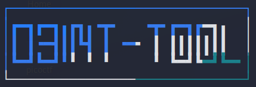

<!-- PROJECT LOGO -->
<br />
<div align="center">
  <a href="#">
    
  </a>

  <h2 align="center">Osint-tool</h2>
  <p align="center">
    <a
      href="https://github.com/Shirshakhtml/Osint-tool/issues/new?assignees=&labels=bug">Report
      Bug</a>
    ·
    <a href="https://github.com/Shirshakhtml/Osint-tool/issues">Request Feature</a>
  </p>

  
  
  

</div>

<h3 align="center">An Osint-based Information Gathering and Recon tool made in Bash for Automation.</h3>

## Installation
1. Run the command `git clone https://github.com/Shirshakhtml/Osint-tool.git`
2. Then run the following ***Requirements*** or run the automation script to install all the required tools ***```sudo bash install.sh```***
   - **Toilet and Figlet :** ```sudo apt install toilet figlet```
   - **Go :** ```sudo apt install golang```
   - **HTTPROBE :** ```go install github.com/tomnomnom/httprobe@latest```
   - **Assetfinder :** ```go install github.com/tomnomnom/assetfinder@latest```
   - **Sublist3r :** ```sudo apt install sublist3r```
   - **NMAP :** ```sudo apt install nmap```
   - **HTTPX** (*requires go1.17*) **:** ```go install -v github.com/projectdiscovery/httpx/cmd/httpx@latest```  

3.After installing the above, move the Golang binaries to the /bin folder so that we can use them independently from any shell (You need to be in ```/home/kali/go/bin``` directory if working in Kali)  

 - ```sudo cp httprobe /usr/bin```
 - ```sudo cp assetfinder /usr/bin```
 - ```sudo cp httpx /usr/bin```
  
## Usage 
```bash
bash osint-tool.sh target-site
```  

## PS
>This project was made using combination of tools made by [Tomnomnom](https://github.com/tomnomnom)
